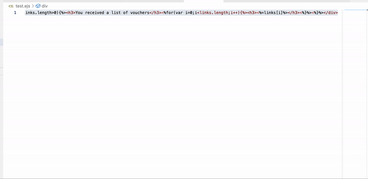

# EJS Beautify

## Beatify EJS



EJS beautify extension. 

### 0.1.0

Current release.

## Settings

Please add the following to 'settings.json'.

```
 "emmet.includeLanguages": {
    "ejs": "html",
  },
 "[html]": {
    "editor.defaultFormatter": "oleksandr.beatify-ejs"
  },
```